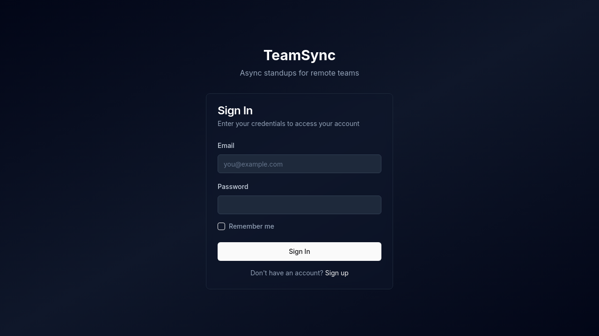
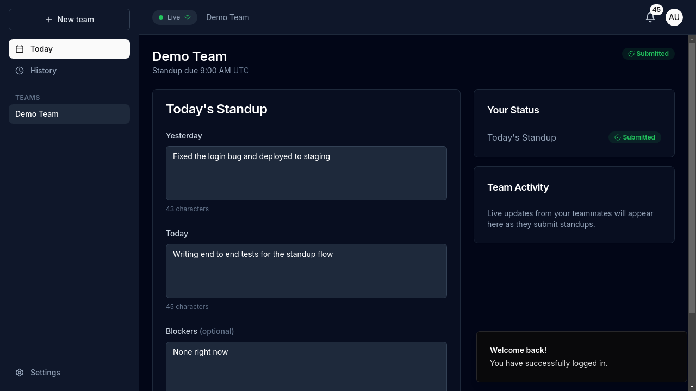
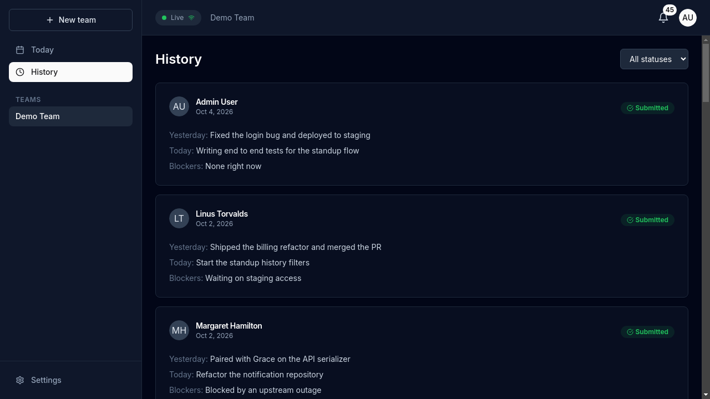
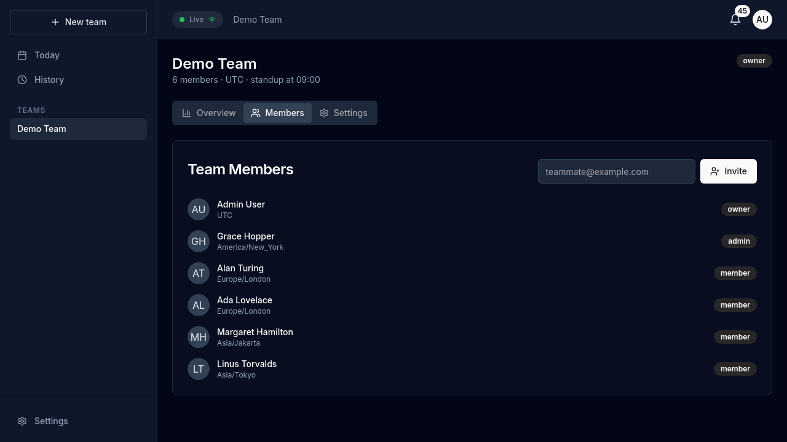
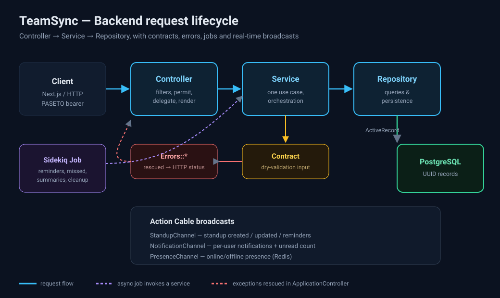

<div align="center">

# TeamSync

**Real-time asynchronous standups for remote, multi-timezone teams.**

Write your standup when it suits you. Everyone else sees it instantly.

[](https://www.ruby-lang.org)
[](https://rubyonrails.org)
[](https://www.postgresql.org)
[](https://redis.io)
[](https://nextjs.org)
[](https://www.typescriptlang.org)
[](#testing)
[](#license)

</div>

---

## Screenshots

### Login



### Today — write and submit your standup



### History — standups across dates and members



### Team management



### Demo


> All screenshots and the GIF are real captures of the seeded app, produced by
> the headed Playwright E2E suite running against the Dockerized stack. See
> [`docs/assets/README.md`](docs/assets/README.md) to regenerate them.

---

## Features

- **Async standups** — yesterday / today / blockers / notes, saved as a draft
  or submitted in under a minute.
- **Timezone-first** — every time is rendered in the viewer's timezone.
- **Real-time** — standups, notifications and presence stream over Action Cable.
- **Teams & roles** — owner / admin / member with invite-by-email and invite
  codes.
- **Standup history** — filter by date range, member and status.
- **Reminders & summaries** — scheduled Sidekiq jobs for standup reminders,
  missed-standup marking and daily summaries.
- **PASETO auth** — stateless access tokens + rotating refresh tokens.

---

## Tech stack

| Layer | Technology |
| --- | --- |
| API | Ruby on Rails 7.1 (API mode) |
| Database | PostgreSQL 15 (UUID primary keys) |
| Jobs / schedule | Sidekiq + sidekiq-scheduler, Redis |
| Real-time | Action Cable (Redis adapter) |
| Auth | PASETO (`v2.public`) + rotating refresh tokens |
| Validation | dry-validation contracts |
| Serialization | jsonapi-serializer |
| API docs | rswag (Swagger UI) |
| Testing | RSpec, FactoryBot, Shoulda Matchers |
| Frontend | Next.js 14, TypeScript, Tailwind, Radix UI, React Query, Zustand |

---

## Architecture

TeamSync's backend is organized in explicit **Controller → Service →
Repository** layers:

```
Controller  ──▶  Service  ──▶  Repository  ──▶  ActiveRecord ──▶ PostgreSQL
                  │
                  ├── Contract (dry-validation input)
                  └── Errors::*  →  rescued & mapped to HTTP in ApplicationController
```

- **Controllers** are thin: filter, permit, delegate, render.
- **Services** own one use case each and orchestrate the domain.
- **Repositories** are the only place that touch persistence for an aggregate.
- **Jobs** are thin wrappers that call a service.



Read the full breakdown, including sequence diagrams, in
[**docs/ARCHITECTURE.md**](docs/ARCHITECTURE.md).

---

## Project structure

```
teamsync/
├── backend/                 # Rails 7.1 API
│   ├── app/
│   │   ├── controllers/     # thin HTTP layer
│   │   ├── contracts/       # dry-validation input schemas
│   │   ├── services/        # use cases (+ errors/, paseto_service)
│   │   ├── repositories/    # persistence boundary
│   │   ├── models/          # associations, validations, enums, scopes
│   │   ├── serializers/     # JSON:API output
│   │   ├── jobs/            # Sidekiq entry points
│   │   └── channels/        # Action Cable
│   └── spec/                # request / service / repository / contract specs
├── frontend/                # Next.js 14 app
├── docs/                    # guides + assets
│   ├── ARCHITECTURE.md
│   ├── DEVELOPER_GUIDE.md
│   ├── USER_GUIDE.md
│   └── assets/
└── README.md
```

---

## Quick start

The whole stack (PostgreSQL, Redis, API, Sidekiq, web) is Dockerized.

```bash
# from the repository root
docker compose up -d --build          # db, redis, api (migrates + seeds), sidekiq, web
```

- API: `http://localhost:13000` · Swagger: `http://localhost:13000/api-docs` ·
  Sidekiq: `http://localhost:13000/sidekiq`
- Web app: `http://localhost:3001`

> The API is published on host port **13000** because 3000 is commonly taken;
> the web app is built with `NEXT_PUBLIC_API_URL=http://localhost:13000`.

Run the headed Playwright E2E suite (and regenerate screenshots/GIF):

```bash
docker compose run --rm e2e xvfb-run -a npx playwright test --headed
```

Local (no Docker) instructions are in the
[Developer Guide](docs/DEVELOPER_GUIDE.md#2-backend-setup).

### Demo credentials (after `db:seed`)

```
email:    admin@teamsync.app
password: password123
```

---

## API overview

| Method | Endpoint | Description |
| --- | --- | --- |
| `POST` | `/api/v1/auth/signup` | Register |
| `POST` | `/api/v1/auth/login` | Log in |
| `POST` | `/api/v1/auth/refresh` | Rotate tokens |
| `DELETE` | `/api/v1/auth/logout` | Revoke refresh token |
| `GET/PUT` | `/api/v1/auth/me` | Current profile |
| `GET/POST` | `/api/v1/teams` | List / create teams |
| `GET/PUT/DELETE` | `/api/v1/teams/:slug` | Show / update / delete team |
| `POST` | `/api/v1/teams/:slug/invite` | Invite a member (admin) |
| `POST` | `/api/v1/teams/:slug/join` | Join via invite code |
| `GET/DELETE` | `/api/v1/teams/:team_slug/members` | List / remove members |
| `PATCH` | `/api/v1/teams/:team_slug/members/:id/update_role` | Change role |
| `GET/POST` | `/api/v1/teams/:team_slug/standups` | List / create standups |
| `GET` | `/api/v1/teams/:team_slug/standups/today` | Today's standup |
| `GET/PUT/DELETE` | `/api/v1/teams/:team_slug/standups/:id` | Show / update / delete |
| `GET/PATCH` | `/api/v1/notifications` | List / update notifications |
| `POST` | `/api/v1/notifications/mark_all_read` | Mark all read |
| `WS` | `/cable` | Action Cable (standups, notifications, presence) |

---

## Testing

```bash
cd backend
bundle exec rspec
```

```
91 examples, 0 failures
```

The suite covers request specs (behavioural contract), plus service, repository
and contract specs for the domain layer.

---

## Documentation

- [**Architecture**](docs/ARCHITECTURE.md) — layers, object flow, diagrams.
- [**Developer Guide**](docs/DEVELOPER_GUIDE.md) — setup, conventions, extending.
- [**User Guide**](docs/USER_GUIDE.md) — how to use the product.
- [Backend reference](backend/README.md) · [Frontend reference](frontend/README.md)

---

## License

MIT
