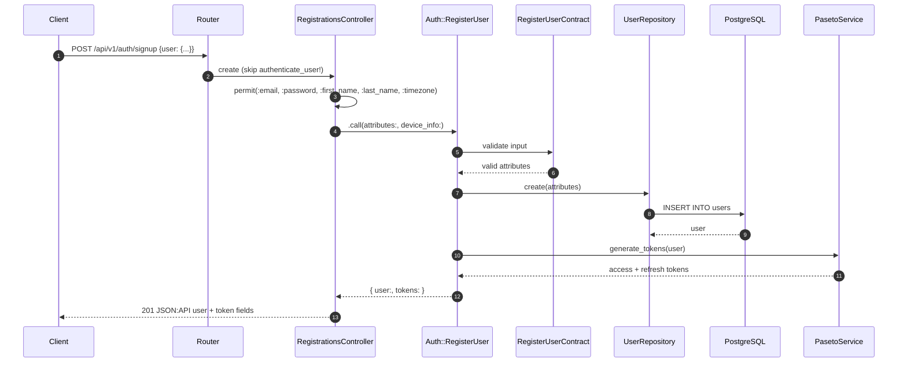
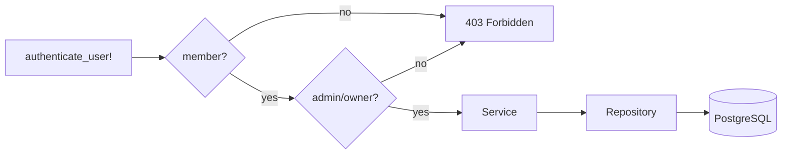

# TeamSync — Technical Architecture

This document explains how a request travels through the backend and, in
particular, how the **Controller → Service → Repository** layers collaborate.

---

## 1. System overview


```
┌─────────────────┐      REST /api/v1        ┌──────────────────────┐      SQL      ┌─────────────┐
│  Next.js app    │ ───────────────────────▶ │  Rails 7.1 API       │ ────────────▶ │ PostgreSQL  │
│  (TypeScript)   │ ◀─────────────────────── │  (PASETO auth)       │ ◀──────────── │  (UUID PKs) │
│                 │   Action Cable /cable    │                      │               └─────────────┘
└─────────────────┘ ◀══════════════════════▶ └──────────┬───────────┘
        ▲                                               │ enqueue
        │                        pub/sub                ▼
        │                                  ┌──────────────────────┐      ┌─────────────┐
        └──────────────────────────────────│  Sidekiq + Redis     │─────▶│   Redis     │
             WebSocket broadcasts           │  (jobs / scheduler)  │      │ cache/queue │
                                           └──────────────────────┘      └─────────────┘
```

- **HTTP layer** — thin Rails API controllers.
- **Domain layer** — services (one use case each) + repositories (persistence).
- **Async layer** — Sidekiq jobs delegate to the same services.
- **Real-time layer** — Action Cable channels broadcast after state changes.

---

## 2. The layers

### 2.1 Controller (`app/controllers/**`)

Controllers only do HTTP work:

1. Run authentication/authorization `before_action` filters.
2. Permit request parameters.
3. Call **exactly one** service.
4. Render the value with a serializer and the right status code.

They never query the database, never contain branching business rules, and
never build domain objects.

```ruby
# app/controllers/api/v1/teams_controller.rb
def invite
  ::Teams::InviteMember.call(team: @team, email: params[:email], role: params[:role])
  render json: { message: "Invitation sent successfully" }, status: :created
end
```

### 2.2 Contract (`app/contracts/**`)

Input validation using `dry-validation`. Each contract describes the shape of
the data a single service accepts. Contracts are invoked by the service through
`ApplicationService#validate`, which raises `Errors::ValidationError` (HTTP 422)
when input is invalid.

```ruby
# app/contracts/teams/invite_member_contract.rb
module Teams
  class InviteMemberContract < ApplicationContract
    params do
      required(:email).filled(:string)
      optional(:role).maybe(:string)
    end
  end
end
```

### 2.3 Service (`app/services/**`)

A service owns one use case. It:

- validates input with its contract,
- orchestrates domain rules and side effects,
- delegates all persistence to repositories,
- returns the domain value **or raises** an `Errors::*` exception.

```ruby
# app/services/teams/invite_member.rb
module Teams
  class InviteMember < ApplicationService
    CONTRACT = InviteMemberContract.new

    def initialize(team:, email:, role: nil)
      @team = team
      @email = email
      @role = role
    end

    def call
      attrs = validate(CONTRACT, email: @email, role: @role)

      user = UserRepository.find_by_email(attrs[:email])
      raise Errors::NotFoundError, "User not found" if user.nil?
      raise Errors::ValidationError, "User is already a member of this team" if TeamMembershipRepository.exists?(@team, user)

      membership = TeamMembershipRepository.create(
        @team, user: user, role: attrs[:role] || :member, joined_at: Time.current
      )

      unless membership.persisted?
        raise Errors::ValidationError.new("Validation failed", details: membership.errors.full_messages)
      end

      membership
    end
  end
end
```

`ApplicationService` gives every service the same public entry point:

```ruby
ApplicationService
  .self.call(**kwargs)        # → new(**kwargs).call
  # private
  # validate(contract, input) # dry-validation + raises Errors::ValidationError
```

### 2.4 Repository (`app/repositories/**`)

A repository is the single boundary between the domain and ActiveRecord for one
aggregate. Services never write raw queries; they ask a repository. This keeps
query logic reusable and testable, and lets us swap persistence later.

```ruby
class TeamMembershipRepository < ApplicationRepository
  class << self
    def with_users(team)
      team.team_memberships.includes(:user).order(role: :desc, joined_at: :asc)
    end

    def find_by_user_id!(team, user_id)
      team.team_memberships.find_by!(user_id: user_id)
    end

    def exists?(team, user)
      team.team_memberships.exists?(user: user)
    end

    def create(team, attributes)
      team.team_memberships.create(attributes)
    end
  end
end
```

### 2.5 Models (`app/models/**`)

Models keep associations, enums, validations, scopes and small domain helpers.
Heavy orchestration (submitting a standup, transferring ownership) lives in
services. Note enums use `_prefix: true`, so predicates are `status_active?`,
`role_owner?`, `status_submitted?`, etc.

### 2.6 Serializers (`app/serializers/**`)

`jsonapi-serializer` classes convert domain objects to JSON:API documents. They
are only called from controllers.

### 2.7 Errors (`app/services/errors/**`)

Domain errors live under the `Errors` namespace (autoloaded as a sub-namespace
of `app/services`). `ApplicationController` maps them to HTTP status codes:

| Error | HTTP |
| --- | --- |
| `Errors::ValidationError` | 422 |
| `Errors::NotFoundError` | 404 |
| `Errors::ForbiddenError` | 403 |
| `Errors::UnauthorizedError` | 401 |

```ruby
rescue_from Errors::ValidationError,  with: :handle_validation
rescue_from Errors::ForbiddenError,   with: :handle_forbidden
rescue_from Errors::NotFoundError,    with: :handle_not_found
rescue_from Errors::UnauthorizedError, with: :handle_unauthorized
```

---

## 3. Request lifecycle

### 3.1 `POST /api/v1/auth/signup` (happy path)



### 3.2 Failure path

If the contract or model fails, the service raises `Errors::ValidationError`.
The service call unwinds, `ApplicationController` rescues it, and the client
receives:

```json
{ "error": "Validation failed", "details": ["Email can't be blank"] }
```

### 3.3 Authorization filters

`Api::V1::BaseController` loads the team from the route param and enforces the
role before the action runs. Route params are `:slug` (member routes) or
`:team_slug` (nested routes).

```ruby
before_action :require_team_membership!, only: [:show, :update, :destroy, :invite]
before_action :require_team_admin!,      only: [:update, :invite]
before_action :require_team_owner!,      only: [:destroy]
before_action :load_team!,               only: [:join] # non-members may join
```



---

## 4. Background jobs

Jobs are thin wrappers around services so the logic is testable and reusable:

| Job | Service | Schedule |
| --- | --- | --- |
| `StandupReminderJob` | `Standups::SendReminders` | hourly |
| `MarkMissedStandupsJob` | `Standups::MarkMissed` | daily 00:00 |
| `DailySummaryJob` | `Standups::BuildDailySummaries` | manual/scheduled |
| `CleanupExpiredTokensJob` | `RefreshTokens::CleanupExpired` | manual/scheduled |

```ruby
class MarkMissedStandupsJob < ApplicationJob
  def perform
    Standups::MarkMissed.call
  end
end
```

---

## 5. Real-time (Action Cable)

State changes broadcast from the model/service layer to subscribers:

| Channel | Purpose |
| --- | --- |
| `StandupChannel` | team standup created/updated/deleted, reminders |
| `NotificationChannel` | per-user notification stream + unread count |
| `PresenceChannel` | online/offline presence (backed by `TEAMSYNC_REDIS`) |

---

## 6. Authentication

- **Access token** — PASETO v2.public (Ed25519), 15-minute lifetime, signed by
  `PasetoService`. Contains `user_id`, `email`, `role`, `exp`, `jti`, `iss`, `aud`.
- **Refresh token** — random value; only its SHA-256 digest is stored in
  `refresh_tokens`. Rotated on every refresh; 30-day lifetime.
- `ApplicationController#authenticate_user!` verifies the bearer token and loads
  the active user via `UserRepository`.

---

## 7. Directory map

```
app/
├── controllers/api/v1/     # HTTP boundary (thin)
├── contracts/              # dry-validation input schemas
├── services/
│   ├── application_service.rb
│   ├── service_result.rb
│   ├── errors/             # Errors::* domain exceptions
│   ├── paseto_service.rb   # token infrastructure
│   └── <domain>/           # use-case services
├── repositories/           # persistence/query boundary
├── models/                 # associations, validations, enums, scopes
├── serializers/            # JSON:API output
├── jobs/                   # Sidekiq entry points → services
├── channels/               # Action Cable
└── validators/
```

### Why `app/services/errors` and not `app/errors`?

Every immediate subdirectory of `app/` is a Zeitwerk **root**, so files under
`app/errors/` would define top-level constants (`NotFoundError`), not
`Errors::NotFoundError`. Nesting them under `app/services/errors/` makes the
`Errors::` namespace resolve correctly.

---

## 8. Design rules

1. No ActiveRecord queries in controllers or mailers.
2. One service = one public `#call`, one use case.
3. Every service returns a domain value or raises an `Errors::*`.
4. Repositories are the only place that touch a given aggregate's persistence.
5. Controllers choose the HTTP status; services never render.
6. Cross-aggregate side effects belong in the service that owns the use case.
